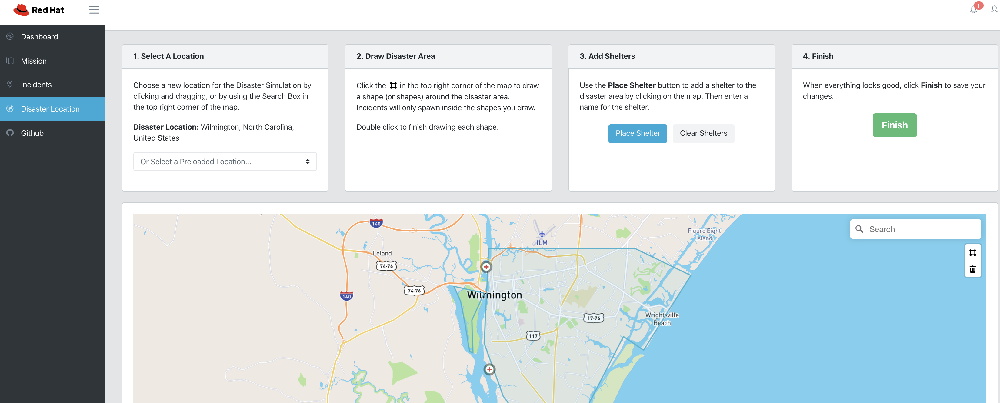
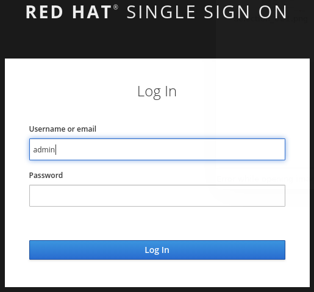

- [1. Emergency Response Admin Console](#1-emergency-response-admin-console)
  - [1.1. Disaster Location](#11-disaster-location)
  - [1.2. Procedure](#12-procedure)
  - [1.3. Priority Zone](#13-priority-zone)
    - [1.3.1. Procedure](#131-procedure)
- [2. SSO Admin Console](#2-sso-admin-console)
- [3.  Red Hat Data Grid](#3-red-hat-data-grid)


This guide details the privileged functions available to the Emergency Response Demo administrator or presenter.


# 1. Emergency Response Admin Console

As part of the Emergency Response Demo installation process, a privileged user is created using the following credentials:

**username:** incident_commander <br/>
**password:** [Defined Here](https://github.com/Emergency-Response-Demo/install/blob/master/ansible/playbooks/group_vars/sso_theme_realm.yml#L7)


This user has the ability to manage priority zones as well as the location of the disaster. Further details about these functions can be found below.

## 1.1. Disaster Location

The incident commander has the ability to change the location at which the disaster simluation is set. If your audience is unfamiliar with Wilmington, North Carolina, this is a great opportunity to use a location that is more well-known or colloquial.

## 1.2. Procedure

1. From the Disaster Location page, refer to the instructions on the wizard. *If you don't see a link for Disaster Location, you're probably not logged in as the correct user (incident_commander).*

_**Note** Be sure to perform this step **before** generating incidents and responders. Generated markers use disaster location data when they are **created**, so updating the location will not affect existing incidents and responders._



## 1.3. Priority Zone

The incident commander has the ability to create _priority zones_ in the _inclusion zone_ of the _disaster area_.  A priority zone could simulate critical conditions (power lines in the water, gas leaks, etc.).  It's recommended that priority zone's be placed within the _inclusion zone_.   Once placed, priority zones give affected incidents elevated priority so they get matched with available responders more quickly.

### 1.3.1. Procedure

1. From the Dashboard, click the **Create Priority Zone** button in the bottom left corner of the map. *If you don't see the button, you're probably not logged in as the correct user (incident_commander).*

2. Drag to create a circle on the map, then adjust the position and size as you see fit. Once you're done, click **Done Drawing**. You may optionally create additional priority zones by repeating this step.

_**Note** The most effective way to demonstrate this feature is to first generate a bunch of incidents, then draw a priority zone around a collection of them, **then** generate responders. If there is a pool of responders waiting for incidents to be generated, incidents will be assigned in the order they are created, and it will appear as though the priority zones are not being taken into account._


# 2. SSO Admin Console
Red Hat Single Sign-On (RH-SSO) provides web security for the various user and admin consoles of the ER-Demo.
It does so by implementing the *Authorization Code Flow* protocol of the *OpenID Connect Specification*.

RH-SSO supports all ER-Demo *instances* that may be deployed on an OpenShift cluster.
Each ER-Demo *instance* utilizes the security settings provided to it by its own dedicated *SSO Realm* in RH-SSO.

As an RH-SSO, you can manage all SSO Realms via the following:

1. Point a browser tab to the output of the following command:
   ```
   echo -en "\n\nhttps://$(oc get route sso --template='{{ .spec.host }}' -n user-sso)/auth/admin/master/console/#/realms/master\n\n"
   ```
   


2.  Authenticate in the _master_ realm of SSO using a userId of _admin_ and a password determined via the following:
    ```
    oc project user-sso

    pod_id=$(oc get pod -o json | jq '.items[]|select(.metadata.labels.deploymentConfig=="sso").metadata.name' | sed 's/"//g')

    oc rsh $pod_id env | grep SSO_ADMIN_PASSWORD

    ```

3.  Switch to your desired SSO realm by hovering over the realm drop-down in the top-left of the page:
   
    


# 3.  Red Hat Data Grid
To-Do
