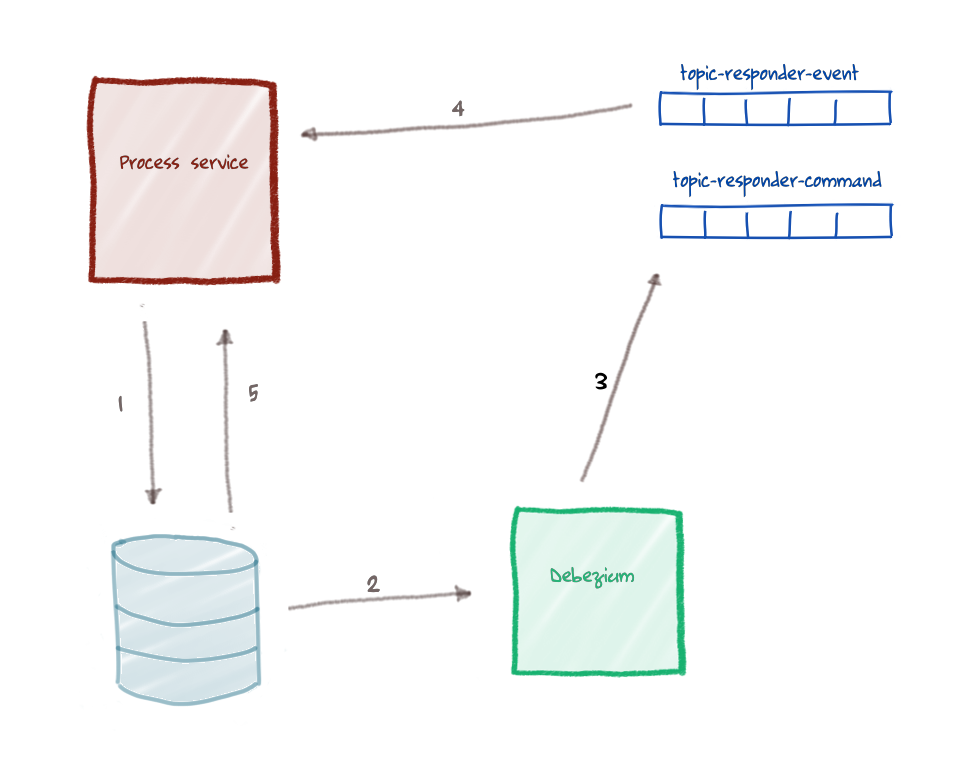

# 1. *Happy Path* Business Processes

The Emergency Response demo is an event-driven architected application using Red Hat AMQ Streams (aka: Apache Kafka) on OpenShift Container Platform.  Red Hat Process Automation Manager (RH-PAM) is also used to orchestrate the message-driven interactions between all of the services of the application.  The BPMN2 business process model (named: [incident-process.bpmn](https://github.com/Emergency-Response-Demo/incident-process-kjar/blob/master/src/main/resources/com/redhat/cajun/navy/process/incident-process.bpmn)) that represents this orchestration at runtime is as follows:


This business process, when viewed in its end-to-end entirety, can be classified as *asynchronous*. This is because the business process defines *wait-states* that decouple execution of its various tasks from one another.  This asynchronous business process paradigm is best discussed in the seminal article: [Your Starbucks Coffee Shop Does Not Use Two-Phase Commit](https://martinfowler.com/ieeeSoftware/coffeeShop.pdf).

However, between these wait-states, the business process executes *synchronously* using a transaction.  This synchronous sequence of steps is depicted in detail as follows:


1. A transaction is started, the process service retrieves the state of a process instance from the database and executes a series of tasks up until the next defined *wait-state*.  As part of this execution, a task in the business process sends a Kafka message to the `topic-responder-command` topic of AMQ Streams. (Semi-related: the ER-Demo *responder-service* consumes and processes this message from that topic).
2. Within this same transaction, the process instance reaches a signal node (which is a *wait-state*) and this transaction is committed (along with the state of the process instance at that time) to the database.  So within this single syncronous transaction there are two writes:  a write to a Kafka topic and a write to a database.
3. The ER-Demo *responder-service* responds back to the process service via the `topic-responder-event` topic.
4. The process service consumes the message on the `topic-responder-event` topic and in a new transaction pulls the process instance state from the database and executes downstream work until the next *wait-state* in the business process is reached.

So to recap, the ER-Demo business process is asynchronous when viewed in its entirety but is synchronous when executing between wait-states.  Under idealistic circumstances this approach generally works fine.


# 2. Pitfalls of Dual-Writes 

In the ER-Demo application, even though the use of synchronous transactions is isolated to execution between wait-states and these transactions tend to be short lived (ie:  ~ 10 millis), problems still occur.

In particular, what has been observed is that in some cases during these synchronous transactions, the delivery, processing and reply of Kafka messages(steps 1 & 3) completes **before** the process instance flush to the PostgreSQL database (Step 2).  When this occurs, the process instance is not yet waiting for the next signal (to initiate the next synchronous transaction), and subsequently the signal is lost. The process instance does not resume execution and `hangs` at the signal node.

This problem most often occurs during execution of the *Update Responder Availability* task of the ER-Demo's *incident-process*:


# 3. *Outbox Pattern* to the Rescue

To some degree, this problem could be resolved if [AMQ Streams / Apache Kafka supported XA transactions](https://gps2nowhere.wordpress.com/2019/09/22/xa-transactions-2-phase-commit-in-kafka/) (aka: Two-Phase Commit (2PC) ).  Even then, however, 2PC introduces its own slew of unintended consequences and considerations.

To resolve the problem of *dual-writes in a single transaction* experienced in the ER-Demo application, the *outbox pattern* has been implemented using technology from the Red Hat sponsored [Debezium open-source project](https://debezium.io/) .  The approach taken is best discussed in [this blog post](https://debezium.io/blog/2019/02/19/reliable-microservices-data-exchange-with-the-outbox-pattern/).

Using the *outbox pattern*, the problem of dual-writes is resolved in the ER-Demo application via the following series of steps in each transaction:





1. Process execution hits the signal node, process state is persisted in the database, together with an outbox event containing the message payload to be sent to the `topic-responder-command`. The outbox event is persisted an *outbox table*.
2. Debezium scans the transaction log of the database and picks up the insert in the outbox table.
3. Debezium sends outbox event to the `topic-responder-command`
4. The process service consumes the reply message, and is able to signal the process instance
5. The process engine signals the process instance in a new transaction.


With the outbox pattern, the message to the `topic-responder-command` is only sent after the transaction is committed to the database. It is no longer the process service that sends the message. Rather the message payload is persisted together with the process state, and Debezium picks up the change event in the database and sends the message to the `topic-responder-command` topic.


# 4. GIVE ME THE DETAILS !!!!


- kafkaconnector
  
```
$ ERDEMO_NS=user1-er-demo    # CHANGE ME (if needed)

$ oc get kafkaconnector debezium-postgres-process-service -o json -n $ERDEMO_NS | jq .spec
{
  "class": "io.debezium.connector.postgresql.PostgresConnector",
  "config": {
    "database.dbname": "rhpam",
    "database.hostname": "process-service-postgresql.user10-er-demo.svc",
    "database.password": "PiqOKMyDWWYv",
    "database.port": "5432",
    "database.server.name": "rhpam1",
    "database.user": "postgres",
    "schema.whitelist": "public",
    "table.whitelist": "public.process_service_outbox",
    "tombstones.on.delete": "false",
    "transforms": "router",
    "transforms.router.route.topic.replacement": "topic-${routedByValue}",
    "transforms.router.table.fields.additional.placement": "type:header:eventType",
    "transforms.router.type": "io.debezium.transforms.outbox.EventRouter"
  },
  "tasksMax": 1
}
```
- Verification
  ```
  $ oc rsh `oc get pod -n $ERDEMO_NS | grep "^process-service-postgresql" | grep "Running" | awk '{print $1}'`
  
  $ curl kafka-connect-connect-api:8083/connectors/debezium-postgres-process-service
  ```

- The database table
```
$ oc rsh `oc get pod -n $ERDEMO_NS | grep "^process-service-postgresql" | grep "Running" | awk '{print $1}'`

$ psql rhpam

rhpam=# \d process_service_outbox
                  Table "public.process_service_outbox"
    Column     |          Type          | Collation | Nullable | Default 
---------------+------------------------+-----------+----------+---------
 id            | uuid                   |           | not null | 
 aggregatetype | character varying(255) |           | not null | 
 aggregateid   | character varying(255) |           | not null | 
 type          | character varying(255) |           | not null | 
 payload       | text                   |           |          | 
Indexes:
    "process_service_outbox_pkey" PRIMARY KEY, btree (id)


```

# 5. Conclusion


