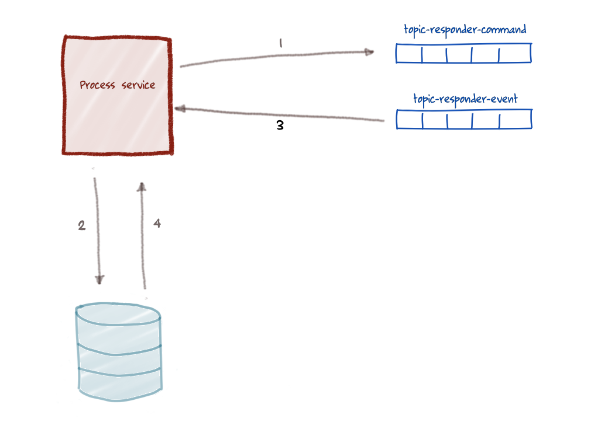

# 1. *Happy Path* Transactions

The Emergency Response demo is an event-driven architected application using Red Hat AMQ Streams (aka: Apache Kafka) on OpenShift Container Platform.  Red Hat Process Automation Manager (RH-PAM) is used to orchestrate the interactions between all of the services that make up the application.  The BPMN2 business process that reflects this orchestration is as follows:


The process engine of RH-PAM commits transactions at each *wait-state* in the business process (ie: at the entry to each *signal node*).  Typically, within each of these transaction commits the process instance state is flushed to a relational database (ie:  PostgreSQL) **and** a Kafka message is produced and sent.  The sequence of these events are as follows:




1. As part of a transaction, the process service sends a Kafka message to the `topic-responder-command` topic where the ER-Demo *responder-service* consumes and processes the message.
2. Within this same transaction, the process instance reaches a signal node and this transaction is committed (along with the state of the process instance at that time) to the database.
3. The ER-Demo *responder-service* responds back to the process server via the `topic-responder-event` topic.
4. The process service consumes the message on the `topic-responder-event` topic and in a new transaction pulls the process instance state from the database and executes downstream work until the next *wait-state* in the business process is reached.


Under ideal circumstances, this *2 Phase Commit* (2PC) transaction works fine.


# 2. 2PC Pitfalls

Much has been written in the past 15 years about the problem of 2 Phase Commit transactions.
Correspondingly, much has been written about alternative approaches as well.

Beyond these typical problems, the 2PC approach used in the ER-Demo exposed an additional unexpected obstacle:  Apache Kafka message processing completes significantly faster than PostgreSQL's write to its database tables.


# 3. *Outbox Pattern* to the Rescue


# 4. DON'T SKIMP ME ON THE DETAILS !!!!

ok, already.  I hear ya.  You want it you got it !


- kafkaconnector
  
```
$ ERDEMO_NS=user1-er-demo    # CHANGE ME (if needed)

$ oc get kafkaconnector debezium-postgres-process-service -o json -n $ERDEMO_NS | jq .spec
{
  "class": "io.debezium.connector.postgresql.PostgresConnector",
  "config": {
    "database.dbname": "rhpam",
    "database.hostname": "process-service-postgresql.user10-er-demo.svc",
    "database.password": "PiqOKMyDWWYv",
    "database.port": "5432",
    "database.server.name": "rhpam1",
    "database.user": "postgres",
    "schema.whitelist": "public",
    "table.whitelist": "public.process_service_outbox",
    "tombstones.on.delete": "false",
    "transforms": "router",
    "transforms.router.route.topic.replacement": "topic-${routedByValue}",
    "transforms.router.table.fields.additional.placement": "type:header:eventType",
    "transforms.router.type": "io.debezium.transforms.outbox.EventRouter"
  },
  "tasksMax": 1
}
```
- Verification
  ```
  $ oc rsh `oc get pod -n $ERDEMO_NS | grep "^process-service-postgresql" | grep "Running" | awk '{print $1}'`
  
  $ curl kafka-connect-connect-api:8083/connectors/debezium-postgres-process-service
  ```

- The database table
```
$ oc rsh `oc get pod -n $ERDEMO_NS | grep "^process-service-postgresql" | grep "Running" | awk '{print $1}'`

$ psql rhpam

rhpam=# \d process_service_outbox
                  Table "public.process_service_outbox"
    Column     |          Type          | Collation | Nullable | Default 
---------------+------------------------+-----------+----------+---------
 id            | uuid                   |           | not null | 
 aggregatetype | character varying(255) |           | not null | 
 aggregateid   | character varying(255) |           | not null | 
 type          | character varying(255) |           | not null | 
 payload       | text                   |           |          | 
Indexes:
    "process_service_outbox_pkey" PRIMARY KEY, btree (id)


```

# 5. Conclusion


